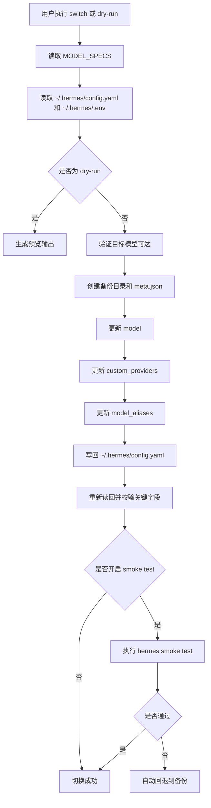

# hermes-model-switch

Hermes Agent 大模型配置管理工具，现已升级为**可测试的 Python CLI 项目**，覆盖以下 11 项核心优化：

1. 修 quickstart 过时内容  
2. 修 SKILL 里错误的备份路径  
3. 统一脚本 / README / CHANGELOG 版本表述  
4. 将三份模型配置合并为单一事实源  
5. 增加 `--dry-run`  
6. 增加 `list/current/verify` 子命令  
7. 增加文件锁防并发写配置  
8. 补测试  
9. 加 GitHub Actions  
10. 提供 example `config/.env`  
11. 逐步拆成 package，而不是单文件大脚本  

## 项目定位

这个项目用于安全切换 Hermes Agent 的默认模型，并维护 `~/.hermes/config.yaml` 中与模型有关的关键配置。

### 已实现能力

#### 


#### 模型切换

- 支持查看当前模型、列出支持模型、预验证目标模型、执行模型切换、dry-run 预览、列出备份、回退备份
- 切换前自动验证目标模型可达，避免把不可用模型写进配置
- 切换前自动备份当前配置，便于失败后回退
- 写入后自动回读校验关键字段，降低配置写坏风险
- 可选执行 Hermes smoke test，验证真实会话链路；失败时自动回退

#### 

## 模型切换流程图



### 非目标 / 项目边界

- **不**自动切换 OpenClaw
- **不**创建或申请 provider 的 API Key
- **不**保证当前会话热切换，建议新会话生效
- **不**管理远端服务商开通状态
- **不**对 `.env` 做加密存储

## 安装

### 方式一：本地开发安装（推荐）

```bash
git clone https://github.com/zhaotianxi/hermes-model-switch.git
cd hermes-model-switch
python3 -m pip install -e .
```

### 方式二：继续使用兼容脚本入口

```bash
mkdir -p ~/.hermes/bin
cp scripts/hermes_switch_model.py ~/.hermes/bin/
chmod +x ~/.hermes/bin/hermes_switch_model.py
```

> 兼容说明：旧用法 `python3 ~/.hermes/bin/hermes_switch_model.py gpt` 仍可用，但内部已走新 CLI。

## 环境要求

- Python 3.9+
- Hermes Agent 已安装
- `~/.hermes/config.yaml` 已存在
- `~/.hermes/.env` 中配置了对应 API Key

## 5 分钟上手

```bash
# 查看支持模型
hermes-model-switch list

# 查看当前模型
hermes-model-switch current

# 先看 dry-run，不落盘
hermes-model-switch switch glm --dry-run

# 真实切换
hermes-model-switch switch glm

# 切换后做 Hermes smoke test
hermes-model-switch switch gpt --smoke-test

# 查看备份
hermes-model-switch backup list
```

## CLI 命令

### 1）列出支持模型

```bash
hermes-model-switch list
hermes-model-switch list --json
```

### 2）查看当前模型

```bash
hermes-model-switch current
hermes-model-switch current --json
```

### 3）预验证目标模型

```bash
hermes-model-switch verify gpt
hermes-model-switch verify glm
hermes-model-switch verify minimax
hermes-model-switch verify ds
```

### 4）切换模型

```bash
hermes-model-switch switch gpt
hermes-model-switch switch glm
hermes-model-switch switch minimax
hermes-model-switch switch ds
```

### 5）dry-run

```bash
hermes-model-switch switch glm --dry-run
```

输出会展示：

- 当前模型
- 目标模型
- 将要写入的主配置
- 对应 provider 定义
- alias 同步结果

### 6）列出备份

```bash
hermes-model-switch backup list
hermes-model-switch backup list --json
```

### 7）回退指定备份

```bash
hermes-model-switch rollback <backup_id>
```

## 兼容入口

旧命令仍兼容：

```bash
python3 ~/.hermes/bin/hermes_switch_model.py gpt
python3 ~/.hermes/bin/hermes_switch_model.py glm
```

等价于：

```bash
hermes-model-switch switch gpt
hermes-model-switch switch glm
```

## 配置架构

- `~/.hermes/.env`：敏感信息
- `~/.hermes/config.yaml`：主配置
- `~/.hermes/backups/<backup_id>/config.yaml`：配置快照
- `~/.hermes/backups/<backup_id>/meta.json`：备份元信息

### 备份结构

```text
~/.hermes/backups/
  20260517T132500Z-gpt/
    config.yaml
    meta.json
```

`meta.json` 包含：

- `backup_id`
- `created_at`
- `source_default`
- `source_mode`
- `target_mode`

## 支持模型

| mode      | 模型                     | default                  | provider                  |
| --------- | ---------------------- | ------------------------ | ------------------------- |
| `gpt`     | GPT-5.4                | `gpt-5.4`                | `custom:modelverse-gpt`   |
| `glm`     | GLM-5.1                | `GLM-5.1`                | `custom:svips-glm`        |
| `minimax` | MiniMax-M2.7-highspeed | `MiniMax-M2.7-highspeed` | `custom:svips-minimax`    |
| `ds`      | DeepSeek-v4-flash      | `deepseek-v4-flash`      | `custom:chudian-deepseek` |

## 模型配置管理（增删改查）

当前实现把模型定义统一收敛到：

- `src/hermes_model_switch/model_specs.py`

其中核心对象是：

```python
MODEL_SPECS = {
    "gpt": {...},
    "glm": {...},
    "minimax": {...},
    "ds": {...},
}
```

也就是说，模型配置的**单一事实源**就在这里。每个模型条目通常包含：

- `label`
- `default`
- `provider_name`
- `provider_ref`
- `base_url`
- `api_key_env`
- `verify_model`
- `alias`
- `models`

### 查（Read）

#### 用户侧查询

```bash
hermes-model-switch list
hermes-model-switch list --json
hermes-model-switch current
hermes-model-switch current --json
```

#### 代码侧查询

- `iter_specs()`：列出全部模型
- `get_spec(mode)`：读取单个模型配置
- `mode_from_default(default_model)`：从当前 default 反查 mode

### 增（Create）

新增模型时，直接在 `MODEL_SPECS` 中新增一个条目即可。

例如新增 `qwen`：

```python
"qwen": {
    "label": "Qwen-Plus",
    "default": "qwen-plus",
    "provider_name": "aliyun-qwen",
    "provider_ref": "custom:aliyun-qwen",
    "base_url": "https://dashscope.aliyuncs.com/compatible-mode/v1",
    "api_key_env": "DASHSCOPE_API_KEY_QWEN",
    "verify_model": "qwen-plus",
    "alias": "qwen",
    "models": {
        "qwen-plus": {
            "context_length": 128000
        }
    },
},
```

加完后，这些能力会自动吃到新模型：

- `hermes-model-switch list`
- `hermes-model-switch verify qwen`
- `hermes-model-switch switch qwen`
- `model` 主配置写入
- `custom_providers` 写入
- `model_aliases` 写入

### 改（Update）

修改模型时，也是在 `MODEL_SPECS` 里直接改对应条目。

常改字段包括：

- `default`
- `provider_ref`
- `base_url`
- `api_key_env`
- `models`

改完后，CLI 会通过下面三个派生函数自动生成最终写入配置：

- `build_main_model_config(spec)`
- `build_provider_def(spec)`
- `build_alias_update(spec)`

它们分别对应 `config.yaml` 中的：

- `model`
- `custom_providers`
- `model_aliases`

### 删（Delete）

删除模型时，直接从 `MODEL_SPECS` 中删除对应条目即可。

例如删除 `ds`：

```python
del MODEL_SPECS["ds"]
```

或直接删掉对应配置块。

删除后：

- `hermes-model-switch list` 不再显示该模型
- `hermes-model-switch verify <mode>` 不再支持该模型
- `hermes-model-switch switch <mode>` 不再支持该模型

> 注意：当前实现的“删”只是不再支持切换该模型，不会自动清理用户现有 `config.yaml` 里旧的 `custom_providers` 或 `model_aliases` 残留项。

## 模型配置如何落到 config.yaml

当前写入链路是：

```text
MODEL_SPECS
  -> build_main_model_config(spec)
  -> build_provider_def(spec)
  -> build_alias_update(spec)
  -> _update_config(...)
  -> 写回 ~/.hermes/config.yaml
```

实际代码位置：

- 单一事实源：`src/hermes_model_switch/model_specs.py`
- 写入逻辑：`src/hermes_model_switch/cli.py` 中的 `_update_config()`

## 示例文件

仓库内提供：

- `examples/config.yaml.example`
- `examples/.env.example`

### config.yaml 示例片段

```yaml
model:
  default: gpt-5.4
  provider: custom:modelverse-gpt
  base_url: https://api.modelverse.cn/v1
  api_key: ${MODELVERSE_API_KEY_GPT}

custom_providers:
  - name: modelverse-gpt
    base_url: https://api.modelverse.cn/v1
    api_key: ${MODELVERSE_API_KEY_GPT}
    model: gpt-5.4
    models:
      gpt-5.4:
        context_length: 200000

model_aliases:
  gpt:
    provider: custom:modelverse-gpt
    base_url: https://api.modelverse.cn/v1
    model: gpt-5.4
    api_key: ${MODELVERSE_API_KEY_GPT}
```

### .env 示例片段

```dotenv
MODELVERSE_API_KEY_GPT=sk-your-gpt-key
SVIPS_API_KEY_GLM=sk-your-glm-key
SVIPS_API_KEY_MINIMAX=sk-your-minimax-key
CHUDIAN_API_KEY_DEEPSEEK=sk-your-deepseek-key
```

## 目录结构

```text
hermes-model-switch/
├── README.md
├── CHANGELOG.md
├── pyproject.toml
├── examples/
├── scripts/
│   └── hermes_switch_model.py      # 兼容入口
├── src/
│   └── hermes_model_switch/
│       ├── cli.py                  # 新 CLI
│       ├── model_specs.py          # 单一事实源
│       ├── config_io.py
│       ├── backup.py
│       ├── verify.py
│       └── locking.py
├── tests/
├── .github/workflows/ci.yml
└── skill/
```

## 开发与测试

```bash
python3 -m pip install -e .[dev]
python3 -m py_compile scripts/hermes_switch_model.py tools/model-diagnosis.py src/hermes_model_switch/*.py tests/*.py
pytest
```

## 版本说明

当前版本：**1.1.0**

版本叙事统一采用 **semver**：

- `1.0.0`：初始公开版本
- `1.1.0`：完成 11 项核心工程化改造

此前文档中的 v6 / v7 属于历史修复阶段，不再作为对外主版本号。

## License

MIT
